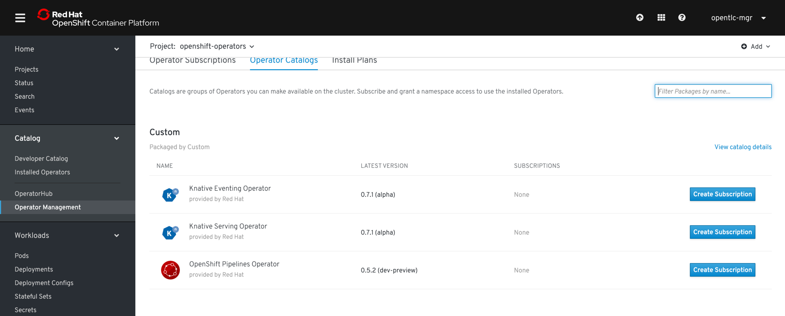
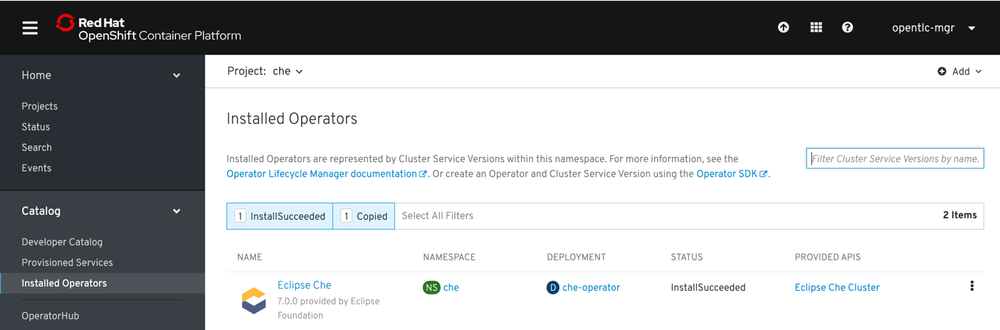
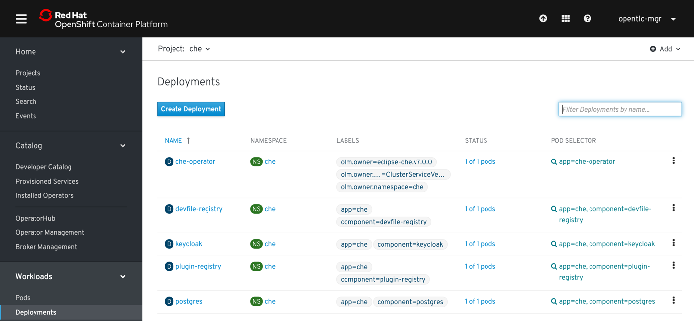

= Red Hat Developers Workshop Guide

How to setup the workshop using OpenShift4 

== Pre-req

The scripts uses these tools for various functions, please have them installed before proceeding further in the setup.

- https://github.com/mikefarah/yq[yq]
- https://stedolan.github.io/jq/[jq]
- https://github.com/che-incubator/chectl[chectl]

== OCP4 Setup

=== RHPDS

Setup OpenShift4 Cluster via RHPDS 

=== Bring Your Own Cluster (BYC)
Create a OCP4 cluster by visiting try.openshift.com and downloading the openshift installer binary for Linux or Mac

1) ./openshift-install --dir=june22v2 create install-config

Follow the prompts for your SSH key, your favorite AWS Region, your Route53 domain, your PullSecret (visible at try.openshift.com), etc. This creates a directory called "june22v2" and inside it a file called install-config.yaml

2) Edit this file to override your AWS Instance Types (the default ones are tiny), here is an example snippet

----
  name: worker
  platform: 
     aws:
       type: m5.4xlarge

  name: master
  platform: 
     aws:
       type: c5.4xlarge
----

3) ./openshift-install --dir=june22v2 create cluster

4) You can monitoring the activity by refreshing your AWS EC2 console

5) Make note of the resulting URLs and the kubeadmin password when the process is completed.  It will take several minutes, go have lunch.

6) Also keep the kubeconfig file in june22v2/auth

7) OpenShift4 CLI for your environment from https://mirror.openshift.com/pub/openshift-v4/clients/ocp/latest/.

== Assumption

Its assumed that the cluster has been setup in one of the ways as above.

== Workshop setup

=== RHPDS

Once you have setup the cluster with RHPDS, please login with the cluster admin

==== Install Nexus

Since there will be lot java artifacts required 

[source,bash,subs="attributes+,+macros"]
----
oc adm new-project rhd-workshop-infra
oc new-app -n rhd-workshop-infra sonatype/nexus
----

==== Install Istio 

[IMPORTANT]
=====
**ONLY FOR RHPDS**
The RHPDS by default applies a `ClusterResourceQuota` to the cluster, you need to remove the `ClusterResourceQuota` or alter to allow extra CPU/RAM for successful Istio install
=====

[source,bash,subs="attributes+,+macros"]
----
# (optional) take a the back up of listed clusterresource quotas
oc get clusterresourcequotas.quota.openshift.io clusterquota-opentlc-mgr -o yaml > <your-backup-dir>/clusterquota-opentlc-mgr.yaml
# scale down the operator
oc -n gpte-userquota-operator scale deployments --replicas=0 userquota-operator
# delete the mulitproject clusterresource quota
oc delete clusterresourcequotas.quota.openshift.io clusterquota-opentlc-mgr
# check if its deleted
oc get clusterresourcequotas.quota.openshift.io
----

Istio is installed using the https://maistra.io[Maistra] operators. The instructions below are stripped down version of https://maistra.io/docs/getting_started/install/[Install on OCP]  and targetted only for OCP4.

[source,bash,subs="attributes+,+macros"]
----
oc adm new-project istio-operator
oc apply -n istio-operator -f https://raw.githubusercontent.com/Maistra/istio-operator/maistra-0.11/deploy/maistra-operator.yaml
# verify deployment to see if the pods are created
oc get pods -n istio-operator -l name=istio-operator -w 
----

===== Deploy Control Plane

[source,bash,subs="attributes+,+macros"]
----
oc adm new-project istio-system
oc apply -n istio-system -f config/basic-install.yaml
----

NOTE: It will take sometime for Istio to be deployed completely

Wait for all the Istio Pods to be available
[source,bash,subs="attributes+,+macros"]
----
oc -n istio-system get pods -w
----

===== Get all Service URLS of Istio Services

[source,bash,subs="attributes+,+macros]
----
oc get routes -n istio-system -o custom-columns='NAME:.metadata.name,URL:.spec.host'
----

=== Install Operators

All the components such as Knative Serving, Knative Eventing, Eclipse Che and Tekton will be installed using operators via https://opeatorhub.io[Opeator Hub]. As a first step towards that we need to install the sources from where the components will be installed

[source,bash,subs="attributes+,+macros]
----
./workshopper installCatalogSources
----

[NOTE]
====
It will take few minutes to get the operator sources to be configured
====

Please check if your Operator Catalog looks like below before proceeding to next steps:

Navigate to project `openshift-operators` and navigate to menu:Catalog[Operator Management > Operator Catalogs]

==== Install Eclipse Che

[source,bash,subs="attributes+,+macros]
----
oc adm new-project che --description="Eclipse Che"
./workshopper installChe
----

[NOTE] 
====
It will take few minutes for the Che operator to appear, please wait for it before doing the next step. You can watch the status of the Eclipse Che operator via 
[source,bash,subs="attributes+,+macros]
----
oc get pods -n che -w
----
====

[IMPORTANT]
====
Patch the Eclipse Che operator for enabling Keycloak tokenExchange. This will be removed in next release of Eclipse che
[source,bash,subs="attributes+,+macros]
----
oc get clusterserviceversions  -n che eclipse-che.v7.0.0 -o yaml | yq w - 'metadata.annotations.containerImage' 'quay.io/dfestal/che-operator:enable-token-exchange' | yq w - 'spec.install.spec.deployments[0].spec.template.spec.containers[0].image' quay.io/dfestal/che-operator:enable-token-exchange | oc apply -n che -f -
----
====

Navigate to project `che` and navigate to menu:Home[Projects > che], please wait for some time for the operator to get installed, a successful Eclipse Che Operator install will be like:

[source,bash,subs="attributes+,+macros]
----
./workshopper createCheCluster
----

It will take few mins for Eclipse Che and its components to be running, you can check the status using the command `oc get -n che get pods -w `

A successful Eclipse Che install will have the following components

===== Disable waiting for PV

Update the ConfigMap `custom` in `che` namespace with value `CHE_INFRA_KUBERNETES_PVC_WAIT__BOUND: 'false'`

[source,bash,subs="attributes+,+macros]
----
oc scale deployments -n che che --replicas=0 &&\
oc get cm -n che custom -oyaml | yq w - 'data.CHE_INFRA_KUBERNETES_PVC_WAIT__BOUND' '"false"' | oc apply -n che -f - &&\
oc scale deployments -n che  che --replicas=1
----

====== Get Keycloak Password

[source,bash,subs="attributes+,+macros]
----
export KEYCLOAK_PASSWORD=$(oc get -n che deployment keycloak -o jsonpath='{.spec.template.spec.containers[*].env[?(@.name=="KEYCLOAK_PASSWORD")].value}')
----

You can get the Eclipse Che URL using the command `oc get routes -n che che -o yaml | yq r - 'spec.host'`
You can get the Eclipse Che Keycloak URL using the command `oc get routes -n che keycloak -o yaml | yq r - 'spec.host'`

==== Install Knative

We will be using Knative Serving and Knative Eventing Operators to install Knative Serving and Eventing components:

===== Knative Serving

[source,bash,subs="attributes+,+macros]
----
./workshopper installKnativeServing
----

[NOTE]
====
It will take few minutes for the Knative serving pods to appear please run the following commands to watch the status:
[source,bash,subs="attributes+,+macros]
----
oc -n knative-serving get pods -w
----
====

===== Knative Eventing

[source,bash,subs="attributes+,+macros]
----
./workshopper installKnativeEventing
----

[NOTE]
====
It will take few minutes for the Knative eventing pods to appear please run the following commands to watch the status:
[source,bash,subs="attributes+,+macros]
----
oc -n knative-eventing get pods -w
----
====

===== OpenShift Pipelines

[source,bash,subs="attributes+,+macros]
----
./workshopper installPipelines
----

[NOTE]
====
It will take few minutes for the OpenShift pipelines pods to appear please run the following commands to watch the status:
[source,bash,subs="attributes+,+macros]
----
oc -n openshift-pipelines get pods -w
----
====

== Workshop users, projects and quotas

=== Set Environment Variables
Copy `setEnv.example` to `setEnv.sh`. Edit `setEnv.sh` and update the variables with values to match your environment:

=== Cache frequently used container images

[source,bash,subs="attributes+,+macros]
----
./workshopper cacheImages
----

=== Create Workshop Users

[NOTE]
=====
If you are using RHPDS then the users are already created, hence you skip this step
=====

[source,bash]
----
./workshopper createUsers
----

=== Create Workshop User Group and Role
[source,bash]
-----
./workshopper usersAndGroups
-----

You can check the group users via command, which should basically list all workshop users.

[source,bash]
----
oc get groups workshop-students
----

=== Create Workshop Projects

[source,bash]
-----
./workshopper configProjects
-----

=== Create Eclipse Che Users

[source,bash]
-----
./workshopper createCheUsers
-----

=== Create Eclipse Che User Workspaces

[source,bash]
-----
./workshopper createWorkspaces
-----

It will take sometime to create the workspaces, all the workspaces created will be logged in `$PROJECT_HOME/workspace.txt` file.

== Cleanup

[source,bash]
-----
./workshopper cleanup
-----